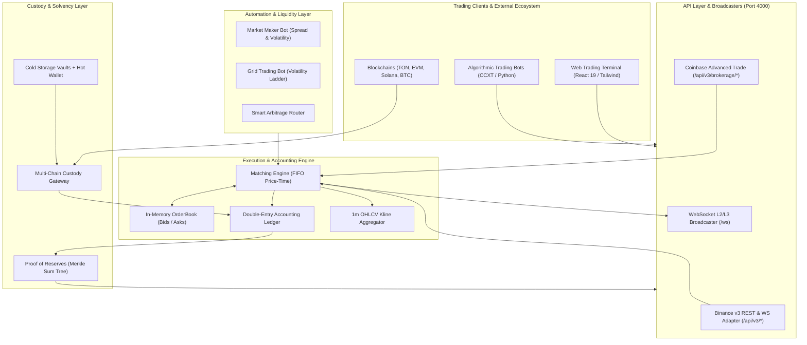

<div align="center">

# ⚡ QMOOSA EXCHANGE ⚡
### Next-Generation Institutional Cryptocurrency Spot Exchange

[](https://opensource.org/licenses/Apache-2.0)
[](https://www.typescriptlang.org/)
[](https://react.dev/)
[](https://tailwindcss.com/)
[](https://github.com/elon00/qmoosa-exchange)
[](https://github.com/elon00/qmoosa-exchange)

**Qmoosa Exchange** synthesizes the open-source microservice modularity of **HollaEx**, the high-frequency trading speed and API standards of **Binance**, and the multi-tier custody and Merkle Sum Tree Proof-of-Reserves security of **Coinbase**.

</div>

---

## 🌟 Key Highlights

- 🏎️ **In-Memory FIFO Matching Engine**: Deterministic, sub-millisecond price-time priority order matching with partial fills and real-time cancelation.
- ⚖️ **Double-Entry Financial Ledger**: Strict mathematical zero-sum invariant audits guaranteeing that total customer deposits equal circulating assets and fee reserves.
- 🛡️ **Cryptographic Proof of Reserves (PoR)**: Binance & Coinbase standard Merkle Sum Tree liabilities auditing, enabling users to verify their account solvency without privacy leakage.
- 🌐 **Dual Standard API Compatibility**:
  - **Binance v3 REST & WebSocket API** (`/api/v3/*`): Compatible with standard algorithmic trading bots, CCXT, and quant connectors.
  - **Coinbase Advanced Trade API** (`/api/v3/brokerage/*`): Standard institutional product, order, and portfolio endpoints.
- 🤖 **Algorithmic Liquidity & Automation**:
  - **Autonomous Market Maker Bot**: Continuously quotes multi-level bids and asks using an Avellaneda-Stoikov inventory model.
  - **Grid Trading Bot**: Deploys dynamic buy/sell ladders within configurable price channels to harvest market volatility.
  - **Smart Arbitrage Router**: Scans and executes price anomalies across cross-venue liquidity pools.
- 💎 **Native Multi-Chain Custody**: Architecture for **TON (Toncoin / Gram)**, **Ethereum (EVM)**, **Solana**, and **Bitcoin** with segregated Hot, Warm, and Cold storage tiers.
- 💻 **Pro Trading Terminal UI**: Dark-mode responsive terminal built with React 19, real-time candlestick charts, live L2/L3 orderbook depth, trade tape, and interactive PoR verifier.

---

## 🏗️ Architecture Blueprint



*For comprehensive architecture details, see [docs/BLUEPRINT.md](docs/BLUEPRINT.md).*

---

## 📁 Repository Structure

```
qmoosa-exchange/
├── docs/
│   ├── BLUEPRINT.md             # In-depth architectural blueprint & component diagrams
│   └── ROADMAP.md               # 5-phase strategic expansion & compliance roadmap
├── public/
│   └── qmoosa-logo.svg          # Brand identity SVG asset
├── src/
│   ├── api/
│   │   ├── binanceAdapter.ts    # Binance v3 REST API endpoints (/api/v3/*)
│   │   ├── coinbaseAdapter.ts   # Coinbase Advanced Trade endpoints (/api/v3/brokerage/*)
│   │   └── server.ts            # Unified Express HTTP & WebSocket broadcaster
│   ├── automation/
│   │   ├── ArbitrageRouter.ts   # Smart order router for cross-venue spreads
│   │   ├── GridTradingBot.ts    # Algorithmic grid trading strategy
│   │   ├── MarketMakerBot.ts    # Avellaneda-Stoikov market maker bot
│   │   └── run-market-maker.ts  # Standalone CLI runner for MM bot
│   ├── custody/
│   │   ├── MultiChainGateway.ts # Multi-chain address derivation & deposit processing
│   │   └── ProofOfReserves.ts   # Merkle Sum Tree liabilities and solvency verification
│   ├── engine/
│   │   ├── Ledger.ts            # Double-entry ledger with balance reservation & audits
│   │   ├── MatchingEngine.ts    # In-memory FIFO matching engine & kline generator
│   │   ├── OrderBook.ts         # High-speed orderbook with O(1) order cancellation
│   │   └── types.ts             # Strict TypeScript definitions
│   ├── ui/
│   │   └── App.tsx              # Professional web trading terminal UI
│   ├── index.css                # Dark theme & Tailwind stylesheet
│   └── main.tsx                 # React client entry point
├── tests/
│   └── engine.test.ts           # Comprehensive test suite (Ledger, Matching, PoR)
├── index.html                   # HTML entry
├── package.json                 # Dependencies and build scripts
├── tailwind.config.js           # Custom trading palette configuration
└── tsconfig.json                # TypeScript compiler configuration
```

---

## 🚀 Quick Start Guide

### 1. Prerequisites
- **Node.js**: v18.0.0 or higher
- **npm** or **pnpm**

### 2. Installation
```bash
git clone https://github.com/elon00/qmoosa-exchange.git
cd qmoosa-exchange
npm install
```

### 3. Run Unit Tests
Verify that the matching engine, double-entry ledger, and Proof-of-Reserves Merkle Sum Tree pass all tests:
```bash
npm test
```

### 4. Start the Backend Exchange Server
Launches the HTTP engine on port `4000`, exposes Binance & Coinbase APIs, starts WebSocket broadcaster, and spins up the autonomous market maker:
```bash
npm run dev:server
```

### 5. Launch the Web Trading Terminal
In a separate terminal window:
```bash
npm run dev
```
Open [http://localhost:5173](http://localhost:5173) in your browser to trade on the live terminal.

---

## 📡 API Usage Examples

### 1. Binance v3 API Endpoints
```bash
# Get Order Book Depth
curl -X GET "http://localhost:4000/api/v3/depth?symbol=TONUSDT&limit=10"

# Place a Limit Order
curl -X POST "http://localhost:4000/api/v3/order" \
  -H "Content-Type: application/json" \
  -d '{"symbol": "TONUSDT", "side": "BUY", "type": "LIMIT", "quantity": "100", "price": "6.45"}'

# Get 24hr Ticker Statistics
curl -X GET "http://localhost:4000/api/v3/ticker/24hr?symbol=TONUSDT"
```

### 2. Coinbase Advanced Trade API Endpoints
```bash
# List Available Products
curl -X GET "http://localhost:4000/api/v3/brokerage/products"

# Fetch Product Orderbook
curl -X GET "http://localhost:4000/api/v3/brokerage/product_book?product_id=TON-USDT"
```

### 3. Cryptographic Proof of Reserves Auditing
```bash
# Fetch Exchange Solvency & Merkle Root Liabilities
curl -X GET "http://localhost:4000/api/custody/reserves"

# Get Individual User Merkle Audit Proof
curl -X GET "http://localhost:4000/api/custody/proof/user_trader1"
```

---

## 🛡️ License & Acknowledgements

- **License**: [Apache-2.0](LICENSE)
- **Author**: Martin Luther ([@elon00](https://github.com/elon00))
- Inspired by the open-source pioneering work of **HollaEx**, the performance standards of **Binance**, and the solvency transparency of **Coinbase**.
