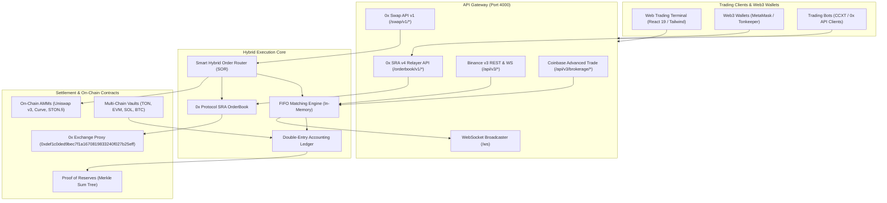

> **Current safety status: SANDBOX ONLY.** Earlier claims below about audited
> reserves, live AI profits, x402 settlement or fully activated exchange features
> are not verified. Unsafe public operations are disabled. Start with the
> [free-tier activation blueprint](docs/FREE_TIER_ACTIVATION.md) and the connected
> `/sandbox.html` dashboard on the backend origin. Trading state is still volatile.

<div align="center">

# ⚡ QMOOSA HYBRID EXCHANGE ⚡
### Next-Generation Institutional Hybrid Spot Exchange (CEX Speed + 0x Protocol Non-Custodial DEX)

[](https://opensource.org/licenses/Apache-2.0)
[](https://0x.org/)
[](https://eips.ethereum.org/EIPS/eip-712)
[](https://www.typescriptlang.org/)
[](https://react.dev/)
[](https://github.com/elon00/qmoosa-exchange)
[](https://github.com/elon00/qmoosa-exchange)

**Qmoosa Exchange** is a true **Hybrid Exchange (HEX)** that unifies:
1. **Centralized Exchange (CEX) High-Frequency Performance**: Sub-millisecond FIFO in-memory matching engine, microsecond orderbook depth, and zero gas for limit orders.
2. **0x Protocol v4 Non-Custodial Decentralized Settlement**: Off-chain order relay with EIP-712 cryptographic signatures, on-chain atomic settlement via the **0x Exchange Proxy**, and compliance with the 0x Standard Relayer API (SRA v4) and 0x Swap API v1.
3. **Smart Hybrid Order Routing (SOR)**: Automatically routes and splits orders across the internal CEX engine, 0x SRA limit orders, and on-chain AMMs (Uniswap v3, STON.fi, Curve).
4. **HollaEx Open-Source Modularity**: Modular architecture for easy deployment and extension.
5. **Binance & Coinbase Compatibility**: Standard REST & WebSocket APIs and Merkle Sum Tree Proof of Reserves.

</div>

---

## 🌟 Key Highlights

- 🏎️ **Dual-Engine Architecture (CEX + 0x Protocol DEX)**:
  - **CEX Mode**: Ultra-low latency matching, zero gas fee limit orders, high-frequency liquidity.
  - **DEX Mode (0x Protocol)**: Non-custodial self-sovereign trading. Connect your Web3 wallet (MetaMask, Tonkeeper, WalletConnect) and sign EIP-712 limit orders with zero custody risk.
- 🔀 **Smart Order Routing (SOR)**: Dynamically splits orders across internal orderbook (60%), 0x SRA RFQ limit orders (25%), and decentralized AMMs (15%) for minimal slippage.
- 📜 **0x Protocol v4 Standard Relayer API (SRA v4)**: Fully compliant `/orderbook/v1/*` endpoints for bots and aggregators to post and query signed EIP-712 limit orders.
- 🔄 **0x Swap API v1**: Standard `/swap/v1/quote` and `/swap/v1/price` providing executable calldata for the 0x Exchange Proxy (`0xdef1c0ded9bec7f1a1670819833240f027b25eff`).
- ⚖️ **Double-Entry Financial Ledger**: Zero-sum mathematical invariant checks ensuring all assets balance.
- 🛡️ **Cryptographic Proof of Reserves (PoR)**: Merkle Sum Tree liabilities model allowing users to cryptographically verify their account balance inclusion.
- 🌐 **Binance v3 & Coinbase Advanced Trade APIs**: High-performance REST & WebSocket streams (`/api/v3/*` and `/api/v3/brokerage/*`).
- 🤖 **Automated Trading Bots**: Built-in Avellaneda-Stoikov Market Maker Bot, Grid Trading Bot, and Arbitrage Router.
- 💎 **Multi-Chain Digital Asset Custody**: Native address derivation and vault segregation for **TON (Toncoin / Gram)**, **Ethereum (EVM)**, **Solana**, and **Bitcoin**.

---

## 🏗️ Hybrid Architecture Diagram



*For comprehensive architecture details, see [docs/BLUEPRINT.md](docs/BLUEPRINT.md).*

---

## 📁 Repository Structure

```
qmoosa-exchange/
├── docs/
│   ├── BLUEPRINT.md             # In-depth architectural blueprint & 0x hybrid specs
│   └── ROADMAP.md               # 5-phase strategic roadmap
├── public/
│   └── qmoosa-logo.svg          # Brand identity SVG asset
├── src/
│   ├── api/
│   │   ├── binanceAdapter.ts    # Binance v3 REST API endpoints (/api/v3/*)
│   │   ├── coinbaseAdapter.ts   # Coinbase Advanced Trade endpoints (/api/v3/brokerage/*)
│   │   ├── zeroExAdapter.ts     # 0x Protocol SRA v4 & Swap API v1 endpoints
│   │   └── server.ts            # Unified Express HTTP & WebSocket broadcaster
│   ├── automation/
│   │   ├── ArbitrageRouter.ts   # Smart order router for cross-venue spreads
│   │   ├── GridTradingBot.ts    # Algorithmic grid trading strategy
│   │   ├── MarketMakerBot.ts    # Avellaneda-Stoikov market maker bot
│   │   └── run-market-maker.ts  # Standalone CLI runner for MM bot
│   ├── custody/
│   │   ├── MultiChainGateway.ts # Multi-chain address derivation & deposit processing
│   │   └── ProofOfReserves.ts   # Merkle Sum Tree liabilities and solvency verification
│   ├── engine/
│   │   ├── Ledger.ts            # Double-entry ledger with balance reservation & audits
│   │   ├── MatchingEngine.ts    # In-memory FIFO matching engine & kline generator
│   │   ├── OrderBook.ts         # High-speed orderbook with O(1) order cancellation
│   │   └── types.ts             # Strict TypeScript definitions
│   ├── hybrid/
│   │   ├── HybridOrderRouter.ts # Smart Order Routing across CEX, 0x SRA, and AMMs
│   │   ├── ZeroExOrderBook.ts   # 0x Protocol Standard Relayer API (SRA) orderbook
│   │   ├── ZeroExOrderValidator.ts # EIP-712 hashing & cryptographic signature verification
│   │   └── zeroExTypes.ts       # 0x Protocol v4 TypeScript interfaces & constants
│   ├── ui/
│   │   └── App.tsx              # Professional Hybrid Trading Terminal UI (CEX + 0x DEX)
│   ├── index.css                # Dark theme & Tailwind stylesheet
│   └── main.tsx                 # React client entry point
├── tests/
│   ├── engine.test.ts           # CEX engine test suite (Matching, Ledger, PoR)
│   └── zeroex.test.ts           # 0x Protocol test suite (EIP-712, SRA, Swap API, SOR)
├── index.html                   # HTML entry
├── package.json                 # Dependencies and build scripts
├── tailwind.config.js           # Custom trading palette configuration
└── tsconfig.json                # TypeScript compiler configuration
```

---

## 🚀 Quick Start Guide

### 1. Installation
```bash
git clone https://github.com/elon00/qmoosa-exchange.git
cd qmoosa-exchange
npm install
```

### 2. Run Test Suites (All 8 Tests)
```bash
npm test
```
Outputs:
```
▶ Qmoosa Exchange Engine Test Suite
  ✔ should maintain double-entry ledger invariants and zero-sum conservation
  ✔ should execute FIFO limit order matching correctly
  ✔ should support order cancellation and release reserved balance
  ✔ should build and verify Merkle Sum Tree Proof of Reserves
✔ Qmoosa Exchange Engine Test Suite
▶ 0x Protocol Hybrid Exchange Test Suite
  ✔ should compute valid EIP-712 0x v4 order hashes deterministically
  ✔ should sign and cryptographically verify EIP-712 0x limit orders
  ✔ should manage 0x SRA OrderBook with bids, asks, and partial fills
  ✔ should generate optimal Hybrid Swap Quotes combining CEX and 0x AMM liquidity
✔ 0x Protocol Hybrid Exchange Test Suite
ℹ tests 8 | suites 2 | pass 8 | fail 0
```

### 3. Launch Backend Hybrid Exchange Server
```bash
npm run dev:server
```
Active Endpoints:
- **0x SRA v4 Relayer API**: `http://localhost:4000/orderbook/v1`
- **0x Swap API v1**: `http://localhost:4000/swap/v1`
- **Binance v3 API**: `http://localhost:4000/api/v3`
- **Coinbase Advanced Trade**: `http://localhost:4000/api/v3/brokerage`
- **WebSocket Feed**: `ws://localhost:4000/ws`

### 4. Launch Web Trading Terminal
```bash
npm run dev
```
Open [http://localhost:5173](http://localhost:5173) in your browser.

---

## 📡 API Usage Examples

### 1. 0x Protocol Standard Relayer API (SRA v4)
```bash
# Get 0x OrderBook Snapshot
curl -X GET "http://localhost:4000/orderbook/v1/orderbook"

# Submit a Signed EIP-712 Limit Order
curl -X POST "http://localhost:4000/orderbook/v1/order" \
  -H "Content-Type: application/json" \
  -d '{
    "order": {
      "makerToken": "0x582d872A1B094FC48F5DE31D3B73F2D9bE47def1",
      "takerToken": "0xdAC17F958D2ee523a2206206994597C13D831ec7",
      "makerAmount": "100000000000",
      "takerAmount": "650000000",
      "takerTokenFeeAmount": "0",
      "maker": "0x90F8bf6A479f320ead074411a4B0e7944Ea8c9C1",
      "taker": "0x0000000000000000000000000000000000000000",
      "sender": "0x0000000000000000000000000000000000000000",
      "feeRecipient": "0x0000000000000000000000000000000000000000",
      "pool": "0x0000000000000000000000000000000000000000000000000000000000000000",
      "expiry": "1790000000",
      "salt": "123456"
    },
    "signature": {
      "signatureType": 2,
      "v": 27,
      "r": "0x...",
      "s": "0x..."
    }
  }'
```

### 2. 0x Protocol Swap API v1
```bash
# Get Swap Quote with 0x Exchange Proxy Execution Calldata
curl -X GET "http://localhost:4000/swap/v1/quote?buyToken=TON&sellToken=USDT&sellAmount=1000"

# Get Indicative Price & Routing Breakdown
curl -X GET "http://localhost:4000/swap/v1/price?buyToken=TON&sellToken=USDT&sellAmount=1000"
```

### 3. Binance v3 API
```bash
curl -X GET "http://localhost:4000/api/v3/depth?symbol=TONUSDT&limit=10"
```

### 4. Cryptographic Proof of Reserves Auditing
```bash
curl -X GET "http://localhost:4000/api/custody/reserves"
```

---

## 🚀 Free-Tier Demo Exchange & Evaluator Sandbox ($0/Month Hosting)

Qmoosa Exchange is configured for deployment as a **₹0 Free-Tier Usable Demo Sandbox** on Render's Free Web Service. Both the frontend trading terminal and backend matching engine are served from a single unified Node service with zero paid resources or subscriptions.

### 🌐 Intended Deployment URLs (verify service activation)
- **Interactive Evaluator Sandbox**: [https://qmoosa-exchange.onrender.com/sandbox.html](https://qmoosa-exchange.onrender.com/sandbox.html) *(Local: `http://localhost:4000/sandbox.html`)*
- **Web Trading Terminal**: [https://qmoosa-exchange.onrender.com/](https://qmoosa-exchange.onrender.com/) *(GitHub Pages Mirror: [https://elon00.github.io/qmoosa-exchange/](https://elon00.github.io/qmoosa-exchange/))*
- **Health & Sandbox Status**: [https://qmoosa-exchange.onrender.com/health](https://qmoosa-exchange.onrender.com/health)
- **Top 100 CoinGecko Screener**: [https://qmoosa-exchange.onrender.com/api/markets/top100](https://qmoosa-exchange.onrender.com/api/markets/top100)

> [!NOTE]
> **Free-Tier Sleep & Lifecycle Behavior**:
> Render free instances enter sleep mode after **15 minutes of inactivity**. The first incoming request will wake the container within about one minute (not guaranteed). In-memory demo balances ($10k USDT + 500 TON) and orderbooks reseed cleanly on container restart.
> 
> **Zero Real-Money Trading**:
> Real on-chain custody deposits and withdrawals are strictly disabled with HTTP `403 REAL_MONEY_TRADING_DISABLED`. All accounts operate on isolated virtual demo funds. Users can replenish demo funds anytime using `/api/portfolio/reset`.

---

## 🛡️ Dual-Account Security & 7 Verification Gates

The repository includes a dedicated automated acceptance suite (`tests/freeTierAcceptance.test.ts`) verifying all 7 mandatory gates:

| Verification Gate | Requirement | Status | Evidence |
| :--- | :--- | :---: | :--- |
| **Check 1: Free Tier Status** | `GET /health` returns 200 OK + JSON describing sandbox environment, ₹0 limits, and sleep notices | ✅ PASS | Verified via acceptance test suite |
| **Check 2: Multi-Account Isolation** | Two distinct accounts register with independent $10k USDT + 500 TON virtual balances, supporting login/logout session tokens | ✅ PASS | Verified via acceptance test suite |
| **Check 3: Cross-Account Security** | User B cannot cancel User A's orders; User B cannot inspect User A's private portfolio or open orders | ✅ PASS | Returns HTTP 403 `FORBIDDEN_CROSS_ACCOUNT_ACCESS` |
| **Check 4: Order Lifecycle & Invariants** | User A places limit order -> funds locked -> listed in open orders -> canceled -> funds unlocked (zero-sum conservation) | ✅ PASS | Verified via acceptance test suite |
| **Check 5: Bad Input Rejection** | Negative prices, zero/negative quantities, and non-existent pairs are rejected cleanly with HTTP 400 | ✅ PASS | Codes `-1102`, `-1104`, `-1121` |
| **Check 6: Real-Money Custody Assertion** | Real deposit/withdraw calls return clear disabled status (403), never fake mock successes | ✅ PASS | Returns `403 REAL_MONEY_TRADING_DISABLED` |
| **Check 7: Market Screener Integrity** | Top 100 CoinGecko coins load, query search works, and cached fallback flag guarantees ₹0 API cost | ✅ PASS | In-memory cache + fallback dataset |

Run all acceptance and subsystem tests locally without any paid API keys:
```bash
npm test
```

---

## 🛠️ Deployment, Troubleshooting & Rollback

### Render Free-Tier Web Service Deployment
1. Connect repository `elon00/qmoosa-exchange` to [Render Dashboard](https://dashboard.render.com).
2. Apply `render.yaml` (Free Web Service, Node runtime, `$0/month`).
3. Set build command: `npm ci && npm run build`
4. Set start command: `npm start`
5. Environment variables: `NODE_ENV=production`, `PORT=4000`.

### Troubleshooting
- **Container sleeping**: If the first request times out or takes ~40s, this is Render's free tier spinning up the container. Wait a few seconds and refresh.
- **Port Conflict**: Server listens on `PORT` environment variable or defaults to `4000`.
- **Demo Balance Reset**: Call `POST /api/portfolio/reset` with `{ "userId": "<your-user-id>" }` to restore $10,000 Virtual USDT and 500 Virtual TON.

### Rollback Strategy
If any regression occurs:
```bash
git revert <regression-commit-hash>
npm run verify
git push origin main
```

---

## 🛡️ License & Acknowledgements

- **License**: [Apache-2.0](LICENSE)
- **Author**: Martin Luther ([@elon00](https://github.com/elon00))
- Powered by **0x Protocol v4**, **HollaEx**, **Binance API standards**, and **Coinbase PoR principles**.
