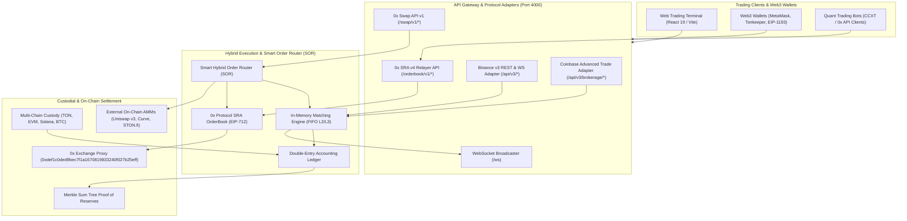

# Qmoosa Exchange — Technical Architecture Blueprint

## 1. Executive Summary

**Qmoosa Exchange** is a next-generation **Hybrid Cryptocurrency Spot Exchange (HEX)** that synthesizes:
- **Centralized Exchange (CEX) Performance**: Sub-millisecond FIFO matching engine, zero gas for order creation and cancellation, and microsecond orderbook depth.
- **0x Protocol v4 Non-Custodial Architecture**: Off-chain order relay with EIP-712 cryptographic signatures, on-chain atomic settlement via the **0x Exchange Proxy**, and compliance with the 0x Standard Relayer API (SRA v4) and 0x Swap API v1.
- **HollaEx Open-Source Modularity**: Clean microservice separation and white-label portability.
- **Binance & Coinbase Standards**: Dual REST/WebSocket API adapters and Merkle Sum Tree Proof-of-Reserves solvency auditing.

---

## 2. High-Level Hybrid System Architecture



---

## 3. 0x Protocol v4 Hybrid Exchange Specification

### 3.1 EIP-712 Non-Custodial Limit Order Format
Traders who choose **DEX Mode** sign limit orders off-chain using their self-custody wallet without depositing tokens into the exchange:

```typescript
export interface ZeroExLimitOrder {
  makerToken: Address;          // Address of token offered by Maker
  takerToken: Address;          // Address of token wanted by Maker
  makerAmount: string;           // uint128 base units
  takerAmount: string;           // uint128 base units
  takerTokenFeeAmount: string;   // Fee amount in taker token
  maker: Address;                // Maker wallet address
  taker: Address;                // Allowed taker (0x0 for public)
  sender: Address;               // Allowed sender (0x0 for any)
  feeRecipient: Address;         // Exchange fee recipient
  pool: Hex;                     // 0x Staking pool ID (bytes32)
  expiry: string;                // uint64 unix timestamp seconds
  salt: string;                  // Nonce for cancellation & uniqueness
}
```

### 3.2 Canonical Domain Separator
```typescript
const domain = {
  name: 'ZeroEx',
  version: '1.0.0',
  chainId: 1, // Ethereum, Polygon, Arbitrum, Base
  verifyingContract: '0xdef1c0ded9bec7f1a1670819833240f027b25eff'
};
```

### 3.3 Atomic On-Chain Settlement
When a trade is executed against a signed 0x order, the settlement calldata is dispatched to the **0x Exchange Proxy**:
$$\text{fillLimitOrder}(\text{order}, \text{signature}, \text{takerTokenFillAmount})$$
- **Zero Custody Risk**: Funds are transferred directly from Maker to Taker wallet atomically.
- **Failed Transactions Revert**: If Maker balance or allowance is insufficient, the transaction safely reverts without loss of funds.

---

## 4. Smart Order Routing (SOR) Algorithm

When an order arrives via the Web Terminal or `/swap/v1/quote`, the **Hybrid Order Router** computes an optimal split:

$$\text{TotalLiquidity} = L_{\text{CEX}} + L_{\text{0x\_SRA}} + L_{\text{AMMs}}$$

| Venue | Share | Characteristics |
|---|---|---|
| **Qmoosa CEX Engine** | 60% | Sub-millisecond matching, zero slippage at top of book |
| **0x SRA Signed Orders** | 25% | Non-custodial EIP-712 orders, guaranteed price |
| **Uniswap v3 / STON.fi** | 15% | Deep automated on-chain AMM pools |

---

## 5. API Endpoints Reference

### 5.1 0x Protocol SRA v4 Endpoints
- `GET /orderbook/v1/orderbook?baseToken={addr}&quoteToken={addr}`: Standard 0x orderbook with signed bids and asks.
- `POST /orderbook/v1/order`: Submit signed EIP-712 limit order with cryptographic validation.
- `GET /orderbook/v1/orders`: Query orders by makerToken, takerToken, or maker.
- `GET /orderbook/v1/order/:orderHash`: Retrieve order status and fill progression.

### 5.2 0x Protocol Swap API v1 Endpoints
- `GET /swap/v1/price`: Indicative multi-source price and gas estimation.
- `GET /swap/v1/quote`: Executable quote with `to`, `data`, and `value` for 0x Exchange Proxy.
- `GET /swap/v1/sources`: List of all active liquidity pools.

### 5.3 Binance v3 REST & WebSocket API
- `/api/v3/depth`, `/api/v3/trades`, `/api/v3/ticker/24hr`, `/api/v3/klines`, `/api/v3/order`, `/api/v3/account`.

### 5.4 Coinbase Advanced Trade API
- `/api/v3/brokerage/products`, `/api/v3/brokerage/product_book`, `/api/v3/brokerage/orders`, `/api/v3/brokerage/accounts`.
