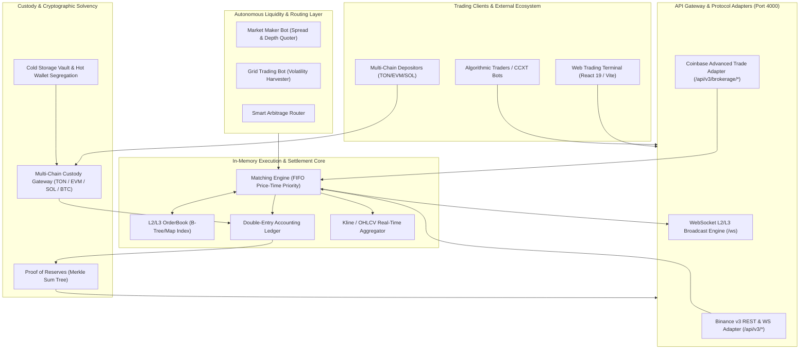

# Qmoosa Exchange — Technical Architecture Blueprint

## 1. Executive Summary

**Qmoosa Exchange** is a high-throughput, institutional-grade cryptocurrency spot exchange architecture designed by synthesizing the open-source modularity of **HollaEx**, the performance and canonical API standards of **Binance**, and the security and Proof-of-Reserves compliance rigor of **Coinbase**.

The exchange is engineered for low latency, zero-sum financial integrity, high liquidity bootstrap capability, and cryptographic solvency auditing.

---

## 2. High-Level System Architecture

---

## 3. Core Engine Subsystems

### 3.1 FIFO Price-Time Priority Matching Engine (`src/engine/MatchingEngine.ts`)
- **Execution Model**: Deterministic single-threaded event loop per market to eliminate race conditions without database mutex overhead.
- **Order Types**:
  - `LIMIT`: Maker/Taker execution with partial fills, GTC (Good-Til-Cancelled), and post-only options.
  - `MARKET`: Immediate execution against available orderbook liquidity.
- **Complexity**:
  - Insert order: $O(\log P)$ where $P$ is distinct price levels.
  - Cancel order: $O(1)$ via internal hash map lookups.
  - Match order: $O(M)$ where $M$ is the number of matched price-time nodes.

### 3.2 Double-Entry Accounting Ledger (`src/engine/Ledger.ts`)
- **Zero-Sum Conservation**: Every credit is balanced by an offsetting debit. Exchange fee accounts capture the spread.
- **Balance States**:
  - `available`: Liquid funds ready for trading or withdrawal.
  - `reserved`: Locked funds committed to active limit orders.
  - `total`: Available + Reserved.
- **Mathematical Invariant**:
  $$\sum \text{UserBalances} + \text{ExchangeFeeReserves} = \text{TotalDepositedFunds}$$

### 3.3 Cryptographic Proof of Reserves (`src/custody/ProofOfReserves.ts`)
- **Merkle Sum Tree**: Standardized liabilities model (Binance / Coinbase specification).
- **Leaf Computation**:
  $$\text{Leaf} = H(\text{userId} \parallel \text{salt} \parallel \text{balances})$$
- **Node Aggregation**:
  $$\text{Node}_{\text{parent}} = H(\text{Hash}_L \parallel \text{Balances}_L \parallel \text{Hash}_R \parallel \text{Balances}_R)$$
  $$\text{Balances}_{\text{parent}} = \text{Balances}_L + \text{Balances}_R$$
- **Verification Guarantee**: Any user can audit that their account balance was incorporated into the published Merkle Root without exposing their identity or balance to any other customer.

---

## 4. Multi-Chain Custody Architecture (`src/custody/MultiChainGateway.ts`)

Qmoosa Exchange partitions institutional digital asset custody into three distinct tiers:

1. **Hot Wallet (Operational Tier - 5% to 10%)**:
   - Handles automated withdrawals and instant deposit crediting.
   - Connected to node RPCs with rate-limited automated signing.
2. **Warm Storage (Treasury Rebalancing - 15% to 20%)**:
   - Multi-signature wallets (3-of-5 threshold) for daily liquidity sweeps.
3. **Cold Storage Vault (Deep Cold - 70% to 80%)**:
   - Air-gapped Hardware Security Modules (HSM) with geographic key distribution.
   - 100%+ backing verifiable on-chain.

### Supported Blockchains
| Network | Asset | Deposit Model | Confirmation Threshold |
|---|---|---|---|
| **TON / Gram** | TON | Address + Memo / Tag | 12 blocks (~30s) |
| **Ethereum / EVM** | USDT, ETH | Deterministic Sub-address (BIP-44) | 32 blocks (~6m) |
| **Solana** | SOL, USDT-SPL | Associated Token Account (ATA) | 31 confirmations (Finalized) |
| **Bitcoin** | BTC | Native SegWit (P2WPKH / Taproot) | 3 confirmations (~30m) |

---

## 5. API Compatibility Layer

### Binance REST & WebSocket (`/api/v3/*`)
- Fully compatible with Binance connector libraries and CCXT.
- Supports `/api/v3/depth`, `/api/v3/trades`, `/api/v3/ticker/24hr`, `/api/v3/klines`, `/api/v3/order`, and `/api/v3/account`.

### Coinbase Advanced Trade (`/api/v3/brokerage/*`)
- Fully compatible with Coinbase Advanced Trade institutional endpoints.
- Supports `/api/v3/brokerage/products`, `/api/v3/brokerage/product_book`, `/api/v3/brokerage/orders`, and `/api/v3/brokerage/accounts`.

---

## 6. Algorithmic Market Making & Grid Automation

1. **Market Maker Bot (`src/automation/MarketMakerBot.ts`)**:
   - Uses an adapted Avellaneda-Stoikov inventory model to quote dynamic two-sided spreads.
   - Self-rebalances inventory and generates organic trading volume.
2. **Grid Trading Bot (`src/automation/GridTradingBot.ts`)**:
   - Equidistant geometric/arithmetic order ladders.
   - Converts price volatility within defined trading ranges into realized quote asset yield.
3. **Arbitrage Router (`src/automation/ArbitrageRouter.ts`)**:
   - Detects price deviations between internal orderbooks and external centralized/decentralized liquidity pools.
