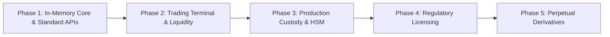

# Qmoosa Exchange — Strategic Roadmap

This document outlines the multi-phase deployment, scale, and compliance strategy for Qmoosa Exchange from initial architecture to global tier-1 institutional operation.

---

## Phase 1: High-Performance Engine Core & Standards (Completed)
- [x] In-memory FIFO Price-Time Priority Matching Engine (`MatchingEngine.ts`).
- [x] Double-entry accounting ledger with mathematical zero-sum conservation (`Ledger.ts`).
- [x] Binance v3 REST & WebSocket API compatibility adapter (`binanceAdapter.ts`).
- [x] Coinbase Advanced Trade REST API adapter (`coinbaseAdapter.ts`).
- [x] Real-time 1m OHLCV / Kline candle aggregator.
- [x] Comprehensive test suite for matching, cancellation, and partial fills.

---

## Phase 2: Web Trading Terminal & Liquidity Automation (Completed)
- [x] Modern Dark-Mode Trading Terminal built with React 19, TypeScript, and TailwindCSS.
- [x] Real-time interactive candlestick and volume depth charts.
- [x] Dynamic L2/L3 orderbook display with spread indicator and depth bars.
- [x] Autonomous Market Maker Bot with Avellaneda-Stoikov quoting model (`MarketMakerBot.ts`).
- [x] Algorithmic Grid Trading Bot for automated range trading (`GridTradingBot.ts`).
- [x] Cross-venue Smart Arbitrage Router (`ArbitrageRouter.ts`).
- [x] Cryptographic Proof-of-Reserves Merkle Sum Tree validator and client auditor (`ProofOfReserves.ts`).

---

## Phase 3: Production Custody, MPC & Hardware Security Modules (Target: Q3 2026)
- [ ] Integration with Fireblocks / Copper ClearLoop / BitGo institutional custody APIs.
- [ ] Multi-Party Computation (MPC) TSS threshold signature scheme for hot wallet keys.
- [ ] Air-gapped Cold Storage Vault signing ceremonies with FIPS 140-2 Level 3 HSMs.
- [ ] Native TON / Gram full-node validation client with automated smart-contract deposit sweeping.
- [ ] EVM Layer 2 deposit rollups (Arbitrum One, Optimism, Base).
- [ ] Solana Anchor smart contract escrow for decentralized custody bridges.

---

## Phase 4: Regulatory Licensing & Institutional Compliance (Target: Q4 2026)
- [ ] Automated KYC / AML onboarding pipeline with Sumsub / Chainalysis KYT integration.
- [ ] Travel Rule compliance protocol (Notabene / Sygna Bridge).
- [ ] SOC 2 Type II and ISO/IEC 27001 security certification audits.
- [ ] Virtual Asset Service Provider (VASP) registrations across key jurisdictions (EU MiCA, UAE VARA).
- [ ] Daily public Merkle Sum Tree liabilities attestations published to IPFS and Ethereum mainnet.

---

## Phase 5: Derivatives, Cross-Margin & Distributed Scaling (Target: 2027)
- [ ] Perpetual Futures matching engine with funding rate calculation and mark price oracles.
- [ ] Cross-margin and isolated margin risk engine with auto-deleveraging (ADL) and insurance fund.
- [ ] Raft-based distributed consensus cluster for matching engine replication across multi-region data centers.
- [ ] FPGA / Kernel-bypass networking (Solarflare OpenOnload) achieving sub-5 microsecond order execution.
